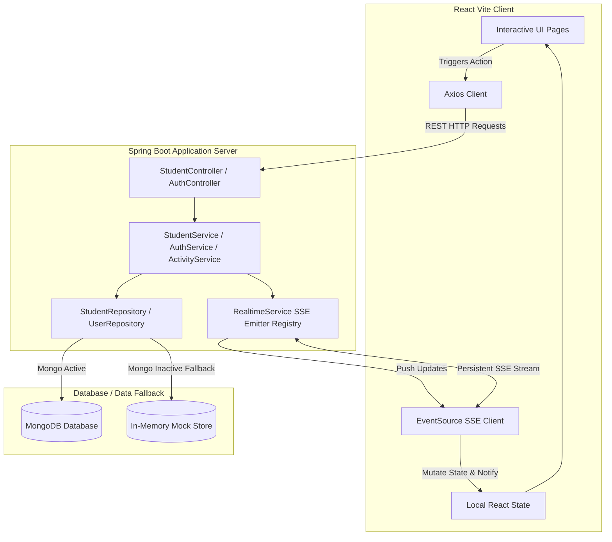

# 🎓 Student Management Hub (CSE 2023-27 Cohort)

[](https://spring.io/projects/spring-boot)
[](https://react.dev)
[](https://vitejs.dev)
[](https://www.mongodb.com)
[](https://developer.mozilla.org/en-US/docs/Web/API/Server-sent_events)

An advanced, full-stack, real-time academic intelligence dashboard designed for modern educational cohorts. Built on a high-throughput **Spring Boot backend** and a beautiful, high-fidelity **React (Vite) frontend**, this application delivers real-time notifications, interactive widgets, granular role-based access, and powerful analytics.

---

## 🏗️ System Architecture

This project implements a highly decoupling client-server architecture with an asynchronous, event-driven realtime stream (SSE) and smart database fallbacks:



---

## ✨ Features

- ⚡ **Real-Time Live Sync (SSE):** Features a dedicated server-push pipeline (`/api/students/stream`) that instantly reflects Student creation, profile edits, grades updates, attendance changes, and user activity across all connected dashboard sessions.
- 💾 **Smart In-Memory Database Fallback:** Zero configuration required. If MongoDB is not running locally, the Spring Boot backend automatically catches the connection failure and seeds a highly realistic in-memory dataset, ensuring a flawless test run right out of the box.
- 🔐 **Granular Role-Based Access Control (RBAC):**
  - **`ADMIN`:** Full CRUD permissions, inline slider updates, multi-gpa overrides, student status toggling, bulk delete operations, and administrative data synchronization.
  - **`STUDENT`:** Secure, read-only interface with a dedicated self-profile editor.
- 📊 **Academic Predictive Engine & Analytics:** Includes live GPA tracking, visual term charts, cumulative CGPA predictors, and cohort-wide placement-readiness intelligence.
- 🎯 **Polished Premium UI/UX:** Sleek dark-mode and light-mode theme options, dynamic transitions, responsive sidebar navigation, interactive modal forms, and notification toasts.

---

## 🛠️ Technology Stack

| Component | Technology | Use Case |
| :--- | :--- | :--- |
| **Backend Core** | **Java 17+, Spring Boot 3.x** | Enterprise application core, REST APIs |
| **Database** | **MongoDB (Optional)** | Persistent document storage |
| **Data Fallback** | **Concurrent Java Map Structures** | Smart in-memory store if MongoDB is down |
| **Realtime Engine**| **SseEmitter (Spring Web)** | Persistent Server-Sent Events channel |
| **Frontend Core** | **React 18.x (Vite & ES6)** | Ultra-fast client interface with modular routing |
| **Styling** | **Vanilla CSS + Glassmorphism** | Harmonious curated dark/light palettes & micro-animations |
| **Icons** | **Lucide React** | Premium icon pack |

---

## 📂 Data Models & Schemas

### 1. `Student` Document
```json
{
  "id": "String (MongoDB Object ID / UUID)",
  "studentId": "String (CSE-2023-001 - Reg. No.)",
  "firstName": "String",
  "lastName": "String",
  "email": "String",
  "phone": "String",
  "department": "String",
  "batch": "String (e.g. 2023-27)",
  "age": 20,
  "gender": "String",
  "address": "String",
  "avatarColor": "String (HSL/Hex for Avatar render)",
  "gpa1": 8.75, "gpa2": 9.10, "gpa3": 8.90, "gpa4": 9.20, "gpa5": 0.0,
  "cgpa1": 8.75, "cgpa2": 8.93, "cgpa3": 8.92, "cgpa4": 8.99, "cgpa5": 0.0,
  "attendance": 88,
  "placementScore": 84.50,
  "isAtRisk": false,
  "backlogs": 0,
  "createdAt": 1716298533000,
  "updatedAt": 1716298533000
}
```

### 2. `User` (Authentication Credentials)
- **`username`**: Matches registration credentials (admin, faculty, or dynamic student ID).
- **`password`**: Encrypted/plain match for simple dev validation.
- **`role`**: `ADMIN` or `STUDENT`.
- **`studentId`**: Links standard accounts to their corresponding `Student` entity.

---

## 🔑 Demo Access & Role Configurations

| Role | Username | Password | Access Rights |
| :--- | :--- | :--- | :--- |
| **System Administrator** | `admin` | `admin123` | Full administrative CRUD + bulk operations |
| **Faculty Coordinator** | `faculty` | `faculty123` | Cohort-wide grade editing & attendance adjustments |
| **Default Student** | `demo` | `demo123` | Read-only cohort analytics & self-profile editing |

> [!TIP]
> **Dynamic Student Logins:** Every imported student receives an auto-generated credential:
> - **Username:** Registration Number (e.g. `CSE-2023-001`)
> - **Password:** First two letters of first name + last three digits of registration number (e.g., Jane Doe with `CSE-2023-087` would login with `Ja087`).

---

## ⚡ REST API Reference

### 🔐 Authentication Operations
* `POST /api/auth/register` - Creates a new dashboard user account.
* `POST /api/auth/login` - Authenticates user credentials and returns active role details.

### 🎓 Student Profile Operations
* `GET /api/students` - Retrieves student list (supports search parameter `q`, filters `status`, sorting `sortBy` / `order`, and pagination).
* `GET /api/students/{id}` - Retrieves a specific student's detailed record.
* `POST /api/students` - Creates a new student record (ADMIN/FACULTY only).
* `PUT /api/students/{id}` - Modifies a student's record.
* `PATCH /api/students/{id}/attendance` - Performs instant attendance updates.
* `PATCH /api/students/{id}/grade` - Updates semester GPAs and automatically re-predicts CGPA.
* `POST /api/students/bulk-delete` - Performs a multi-select batch deletion (ADMIN only).

### 📈 Cohort Analytics & Events
* `GET /api/students/analytics` - Computes and returns class-wide distributions (average CGPA, attendance, placement score, gender split).
* `GET /api/students/activity` - Retrieves live logs of actions performed within the hub.
* `GET /api/students/notifications` - Fetches global announcements and cohort alerts.
* `GET /api/students/stream` - **The Live SSE stream channel**. Persistent HTTP pipeline broadcasting state triggers.

---

## 🚀 Installation & Getting Started

### Prerequisites
- **Java JDK 17** or higher
- **Node.js** v18+ & **npm**
- **Maven** (included helper wrapper or standalone system setup)
- **MongoDB** (Optional - if down, the system handles fallback seamlessly)

### 1. Launching the Spring Boot Backend

1. Navigate to the backend directory:
   ```bash
   cd backend
   ```
2. Build and run the Spring Boot server:
   ```bash
   mvn spring-boot:run
   ```
   * The API server will boot up and automatically listen on **`http://localhost:8080`**.
   * On startup, the console will explicitly show whether it successfully connected to **MongoDB** or if it is running in **In-Memory Fallback Mode** with pre-seeded data.

### 2. Launching the React Vite Frontend

1. Navigate to the frontend directory:
   ```bash
   cd ../frontend
   ```
2. Install the necessary project dependencies:
   ```bash
   npm install
   ```
3. Start the hot-reloading development server:
   ```bash
   npm run dev
   ```
   * Open your browser and navigate to **`http://localhost:5173`** to access the Student Management Hub!

---

## 🎯 Verification and Troubleshooting

- **Testing Real-Time Stream (SSE):** Open the application in two side-by-side browser windows (or one incognito window). Authenticate as `admin` in one and login as a student in another. Update a student's grade or create a new student in the admin panel; you will instantly see the change and notifications animate in real-time in the other window without manual refreshing!
- **Testing MongoDB Fallback:** To test the application without any database installation, simply stop your local MongoDB service and restart the backend. The backend console will safely print the connection log and spin up a lightweight, highly efficient simulated database, letting you test 100% of the functionalities instantly.

---

*Made with 💖 for the CSE 2023-27 cohort.*
